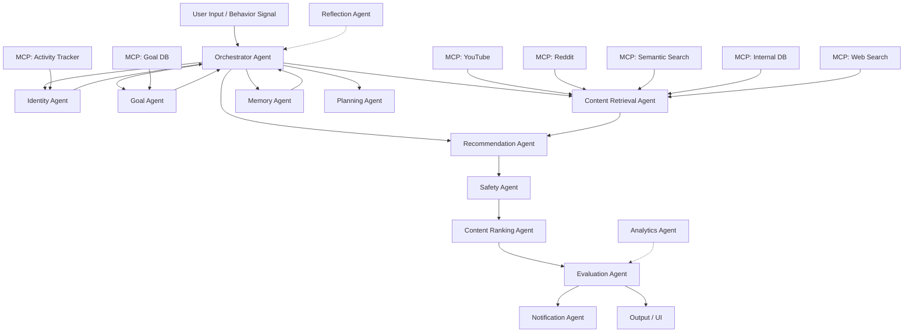
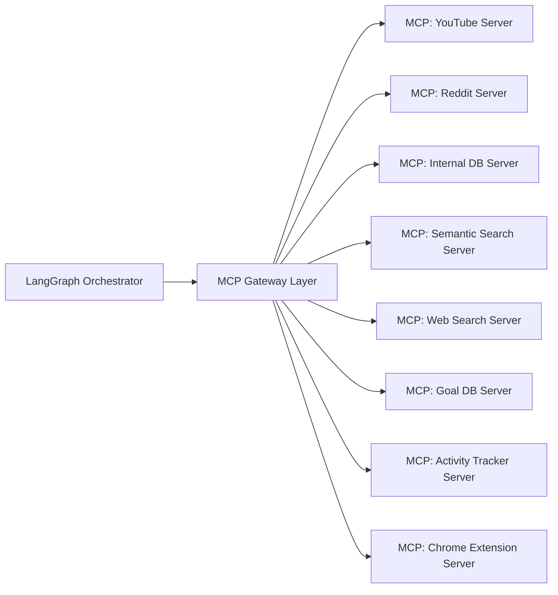

# IABTM Agentic AI Curator — Master Implementation Blueprint

### Version 1.0 | August 2026 | Status: Phase 1 Approved for Execution

---

# 1. Executive Summary

note i have attached the photos along it, they are the inputs taken from the user at the time of registration, so if this md file icludes signin remove that,
see remove signin, because i want to prepare the synthetic data for testing the solution, i have also uploaded what the inputs are taken from the user in form of images, i want a landing page at start showing the importance of I am better than me the asthetics of the landing page should be in off white, white, beige and black colors. the last image i have shared is the image representing the animation that i need on landing page, 12 photos are there in one single photo i want it to animate in such way the photos moves like live video at the rate of 1 scroll two 2 photos fast transition then again 3 photo should be comparetively slowly animated then follow again the same of 1 scroll 2 photos little fast transition...... it should be in the background the opacity should be little less so that the text "I am better than me" should be clearly visible, also there should be a button on navbar displaying let's grow.

## Vision

Transform digital media consumption from passive, algorithm-driven scrolling into a purposeful, identity-aligned journey of self-actualization. IABTM's AI Curator is the intelligence layer of an existing personal-growth platform — an always-on companion that understands _who you are_, _who you want to become_, and _exactly what to put in front of you at this moment in your journey_.

## Mission

Build the world's first multi-agent AI system that optimizes recommendations for **human potential**, not engagement time. Every recommendation must pass an internal "growth score" threshold before surfacing to the user. The system learns not just from what you consume, but from what you _become_ as a result.

## MVP Goal

A fully interactive UI/UX prototype built in Next.js + TypeScript that demonstrates:

1. Complete onboarding flow (current self → future self → goals → media preferences)
2. AI Curator dashboard with simulated agent thinking animation
3. Recommendation feed with growth-score-labeled cards
4. Agent activity log / trace viewer
5. Path visualization (current → imagined self)
6. Identity graph visual

A fully proactive, privacy-preserving AI companion that:

- Monitors digital behavior across platforms (with consent) via Chrome Extension and Desktop App
- Runs a local LLM on-device for maximum privacy
- Maintains a living Identity Graph that evolves weekly
- Curates a personalized "growth path" across film, music, art, animation, editorial, print, podcasts, and community experiences
- Connects users to experts, peers, and communities at precisely the right moment in their journey
- Provides a coach-like AI presence that is proactive, never reactive

## User Value

| User Problem                       | IABTM Solution                                      |
| ---------------------------------- | --------------------------------------------------- |
| Passive scrolling wastes time      | Every recommendation maps to a declared goal        |
| Algorithms optimize for engagement | Engine optimizes for growth potential score         |
| No awareness of personal progress  | Path tracking and milestone visualization           |
| Feels like comparison culture      | "You vs. You" model — self-only benchmarking        |
| Generic self-help content          | Hyper-personalized curation across all media types  |
| No guidance at the right time      | Proactive AI nudges at behaviorally-optimal moments |

## Technical Philosophy

- **AI-first, not AI-bolted-on**: The recommendation logic IS the core product, not a feature
- **Privacy by design**: User data never leaves their control unless explicitly opted in
- **Explainability over black boxes**: Every recommendation shows its reasoning
- **Modularity**: Each agent, MCP tool, and pipeline is independently deployable and testable
- **Human-in-the-loop**: Agents can request user confirmation for high-stakes decisions
- **Graceful degradation**: System works meaningfully with partial data

---

# 2. Product Breakdown

## 2.1 Authentication & Identity

**Purpose**: Secure, friction-free account creation and session management.

- Email + OAuth (Google, Apple)
- JWT + refresh token rotation
- Tiered auth: Guest (preview) → Free → Growth → Pro
- Device fingerprinting for Chrome Extension session linking
- Session persistence across web + extension + desktop app

## 2.2 Onboarding

**Purpose**: First-contact identity extraction. This is the most critical flow.

- Multi-step wizard: Current Self → Imagined Self → Goals → Media Preferences → Learning Style
- Progressive disclosure — never overwhelm; ask 2–3 questions max per screen
- Rich visual selection interface (image-based archetype cards, not dropdowns)
- Immediate "first recommendation" at end of onboarding (reward loop)
- Stores outputs in Identity Graph seed

## 2.3 Identity Graph

**Purpose**: The living representation of who the user is and who they want to become.

- Nodes: Traits, Aspirations, Archetypes, Habits, Skills, Interests, Values
- Edges: Strength, Recency, Source (self-declared / behavior-inferred / agent-inferred)
- Updates on every interaction, recommendation feedback, and weekly reflection
- Visualized as an interactive network graph in the UI
- Powers all agent prompts as "identity context"

## 2.4 Recommendation Engine

**Purpose**: The core value-delivery system.

- Multi-signal scoring: Goal Alignment, Interest Match, Growth Potential, Recency, Diversity
- Content-type coverage: Film, Music, Art, Animation, Editorial, Print, Podcast, People, Experiences
- Explainable output: Each card shows "why recommended" copy
- Feedback: 👍 👎 "Done" "Save" "Not for me" "Too easy" "Too advanced"
- Cold-start strategy: Use onboarding data + archetype templates
- Re-ranking layer: Diversity injection, recency boost, difficulty progression

## 2.5 Agent System (LangGraph Multi-Agent)

**Purpose**: Orchestrated AI intelligence layer.

- Orchestrator Agent (supervisor)
- Identity Agent
- Recommendation Agent
- Memory Agent
- Goal Agent
- Content Retrieval Agent
- Safety Agent
- Notification Agent
- Evaluation/Reflection Agent
- Planning Agent
  _(Full spec in Section 6)_

## 2.6 Media Library & Content Index

**Purpose**: Curated database of all recommendable content.

- Categories: Film, Music, Art, Animation, Editorial, Print, Podcast, Expert talks
- Semantic embedding for each piece of content
- IABTM editorial tags: growth domain, difficulty, format, duration, mood
- Active path content vs. Global media library views
- Shopify integration for product recommendations

## 2.7 Chrome Extension

**Purpose**: Extend IABTM intelligence to all browsing activity.

- Manifest V3 background service worker
- Tracks: page visits, time-on-page, YouTube watch time, Reddit engagement
- Sends encrypted events to backend
- In-browser overlay for recommendations triggered by page context
- Privacy dashboard within extension popup

## 2.8 Activity Tracker

**Purpose**: System-level behavioral data collection (Desktop App phase).

- Lightweight background process (Rust/Tauri)
- ActivityWatch-style rule engine for trigger detection
- No screen recording — metadata only (app names, window titles, time)
- Publishes events to local Redis stream → orchestrator wakes up

## 2.9 Dashboard

**Purpose**: Primary command center for the user's growth journey.

- Curated Media feed (AI-curated, personalized)
- Global Media Viewed (consumption history)
- Expert consultation section
- Activities completed tracker
- Path visualization (current → imagined self journey)
- Path History (milestones achieved)
- AI Agent status panel + thinking animation
- Real-time agent log viewer

## 2.10 Analytics & Metrics

**Purpose**: Internal and user-facing growth metrics.

- User-facing: Growth score trend, Path completion %, Media consumed by domain, Streak
- Internal: Agent trace latency, Tool call success rate, Recommendation CTR, Feedback signal ratio
- LangSmith/Langfuse trace integration

## 2.11 Notification System

**Purpose**: Proactive intelligence delivery.

- Time-based: Morning briefing, Evening reflection, Weekly path review
- Behavior-based: Triggered by Chrome Extension events
- Goal-based: Milestone approaching, Streak at risk
- Digest mode vs. Real-time mode

## 2.12 Privacy & Settings

**Purpose**: User control over their data and AI behavior.

- Privacy mode selector: Cloud / Hybrid / Full Local
- Data export (GDPR)
- Data deletion
- Opt-in/out per data source
- Chrome Extension permissions management
- AI transparency: "Why is the AI suggesting this?"

## 2.13 Community (3605)

**Purpose**: "Real" social layer — You vs. You, not You vs. Them.

- Public posts (existing feature)
- Add friend / growth partner
- Shared path journeys
- Non-comparison design: no follower counts, no likes
- AI-matched peer connections based on Identity Graph similarity

## 2.14 Payments

**Purpose**: Monetization and subscription management.

- Stripe integration
- Tiers: Free, Growth ($X/mo), Pro ($X/mo), Expert consultation credits
- Shopify cart integration for physical products
- Usage-based credits for heavy AI feature use

## 2.15 Expert Consultation

**Purpose**: Human expert connection at the right moment in journey.

- Expert profiles (existing)
- AI-triggered suggestion: "You're ready to speak to an expert on X"
- Booking integration
- Post-consultation AI follow-up

---

# 3. User Journey

## 3.1 Complete Journey Map

```
First Visit (Landing Page)
│
├── Hero: "Become the self you imagine"
├── CTA: "Start Here" / "I want to be better"
│
▼
Signup / Login
├── Email + OAuth
├── Guest preview mode (limited features, no account required)
│
▼
Onboarding Step 1 — Current Self
├── "Who are you right now?"
├── Visual archetype cards (select 3)
├── Quick attribute sliders: Energy / Curiosity / Discipline / Creativity
├── Empty state: "Tell us a little about yourself"
│
▼
Onboarding Step 2 — Imagined Self
├── "Who do you want to become?"
├── Aspirational archetype cards (select 3)
├── Free-form: "Describe your future self in one sentence"
│
▼
Onboarding Step 3 — Goal Selection
├── "What do you want to work on first?"
├── Goal cards: Career / Creativity / Mindset / Health / Knowledge / Relationships / Finance / Purpose
├── Timeline selection: "By when? 3 months / 6 months / 1 year / Ongoing"
│
▼
Onboarding Step 4 — Media Preferences
├── "How do you like to learn and experience?"
├── Media type toggles: Film / Music / Art / Animation / Editorial / Print / Podcast
├── Format: Short-form / Long-form / Both
├── Mood-based: "Learning feels best when I'm..." (Energized / Reflective / Curious / Motivated)
│
▼
Onboarding Step 5 — Learning Style
├── "What's your best way of learning?"
├── Options: Watch / Read / Listen / Do / Discuss / Create
├── Time commitment: "I can dedicate X mins/day to growth content"
│
▼
First Recommendation Reveal (MOMENT OF DELIGHT)
├── Agent thinking animation (brain simulation)
├── "Your curator is thinking..."
├── First 5 cards reveal with animation
├── Each card shows: "Recommended because: [your goal X]"
│
▼
Dashboard (Home)
├── Greeting: "Good morning, [Name]. Here's what's curated for you today."
├── AI Agent status: Active / Thinking / Idle
├── Curated For You feed
├── Active Path progress bar
├── Quick metrics: Streak / Growth Score / Media Consumed
│
▼
Daily Interaction Loop
├── Browse recommendations
├── Mark as watched / read / done
├── Provide feedback (👍 👎 "Not for me")
├── AI journal entry (optional: "How are you feeling today?")
├── Path progress update
│
▼
AI Conversation
├── Chat with curator: "What should I focus on this week?"
├── Agent shows reasoning: "Based on your habit of X and goal Y..."
├── Agent can update goals, path, and preferences from conversation
│
▼
Feedback Loop
├── Weekly reflection prompt (every Sunday)
├── Growth score update
├── Identity graph evolution visualization
├── "You've grown in: [Creativity +12%] [Discipline +7%]"
│
▼
Long-Term Growth
├── Path completion milestone
├── New path suggestion
├── Expert consultation recommendation
├── Community peer match suggestion
```

## 3.2 Screen States Inventory

| Screen         | Normal State          | Empty State                                         | Loading State             | Error State                                                |
| -------------- | --------------------- | --------------------------------------------------- | ------------------------- | ---------------------------------------------------------- |
| Dashboard      | Recommendation feed   | "Let's build your path — complete onboarding"       | Skeleton cards with pulse | "Curator temporarily unavailable. Showing cached content." |
| Onboarding     | Active step           | n/a                                                 | Progress indicator        | "Something went wrong — your progress is saved"            |
| Path View      | Visual journey map    | "No path started yet — start with a goal"           | Path segments shimmer     | "Path data unavailable"                                    |
| Agent Log      | Live trace entries    | "Agent hasn't run yet today"                        | Streaming dots            | "Log stream interrupted"                                   |
| Media Card     | Content + metadata    | n/a                                                 | Shimmer card              | "Content unavailable"                                      |
| Identity Graph | Network visualization | "Your identity graph is growing — keep interacting" | Spinning graph nodes      | "Graph rendering error — try refreshing"                   |
| Search         | Results grid          | "No results — try a different term"                 | Skeleton grid             | "Search unavailable"                                       |

---

# 4. Complete UI/UX Architecture

## 4.1 Navigation Structure

```
App Shell
├── Top Navigation Bar (sticky)
│   ├── IABTM Logo (links home)
│   ├── Search (Cmd+K)
│   ├── Notifications bell (badge)
│   ├── Agent status indicator (pulsing dot: green=active, amber=thinking, grey=idle)
│   └── User avatar (dropdown: Profile, Settings, Privacy, Logout)
│
├── Left Sidebar (desktop, collapsible)
│   ├── Home / Dashboard
│   ├── My Path
│   ├── Media Library
│   │   ├── Film
│   │   ├── Music
│   │   ├── Art
│   │   ├── Animation
│   │   ├── Editorial
│   │   └── Print
│   ├── Podcast
│   ├── Experts
│   ├── 3605 Community
│   ├── Agent Lab (log viewer)
│   └── Shop
│
└── Main Content Area (responsive)
```

## 4.2 Page-by-Page Design Specification

### 4.2.1 Landing Page

- **Hero Section**: Full-viewport split layout
  - Left: Typography "Become the self you imagine" — Satoshi 800 weight, 64px, tight tracking
  - Subtitle: 18px, #4B4B4B, max-width 480px
  - CTA: "Start Here" — black filled pill button, 52px height, 24px horizontal padding
  - Right: Animated collage of media images (existing hero animation, keep it)
- **Video Banner**: Full-bleed autoplay video with sound toggle (existing)
- **IABTM Recommends**: Horizontal scroll card strip (existing, extend with AI badge)
- **Social Proof**: Community member portrait strip (existing)
- **How It Works**: 3-step visual: Profile → Curate → Become
- **AI Teaser**: "Meet your AI Curator" — animated brain preview, link to demo

### 4.2.2 Onboarding Wizard

- **Layout**: Full-screen modal overlay OR dedicated /onboarding route
- **Progress**: Minimal top progress bar (5 steps, dots)
- **Step 1 — Current Self**:
  - H1: "First, tell us about where you are now"
  - Visual card grid: 12 archetype cards (e.g., The Creator, The Seeker, The Builder, The Visionary)
  - Each card: Illustrated icon + label + 1-line description
  - Select up to 3 (highlight with accent border glow)
  - Attribute sliders below: Energy, Curiosity, Discipline, Creativity (0–100 each)
- **Step 2 — Imagined Self**:
  - H1: "Now tell us who you want to become"
  - Same card grid but aspirational archetypes
  - Free-form textarea: "In your own words, describe your future self" (optional, AI uses this)
- **Step 3 — Goals**:
  - H1: "What do you want to work on?"
  - Goal domain cards with icons and color-coded domains
  - Sub-goal: "Be more specific" text input (AI pre-fills suggestions based on selected domain)
  - Timeline: Radio group (styled as pill selector)
- **Step 4 — Media Preferences**:
  - H1: "How do you like to grow?"
  - Media type toggles: Icon + label, multi-select pill style
  - Format preference: Short / Long / Mix
  - Time commitment: Slider (5 min → 2 hrs/day)
- **Step 5 — Learning Style**:
  - H1: "How do you learn best?"
  - Icon-button grid: Watch / Read / Listen / Do / Discuss / Create
  - Optional: Connect YouTube (OAuth), Connect Spotify
- **Completion — First Reveal**:
  - Full-screen dark overlay
  - Animated "brain" orb — pulsing, thinking
  - Copy: "Your AI Curator is analyzing your profile..."
  - 3-second build-up → cards fade in one by one
  - First 5 recommendation cards appear with staggered animation

### 4.2.3 Dashboard (Main Application)

- **Layout**: Left sidebar (240px) + main content area
- **Top of Feed**:
  - Contextual greeting (time-aware: "Good morning", "Good evening")
  - Today's growth snapshot: Streak 🔥 [N] days | Growth Score [XX] | Path [X%]
  - Agent status chip: "Curator is active" with live pulsing dot
- **Curated For You Section**:
  - Section label: "For You Today" with AI badge icon
  - Horizontal scroll row, 4 cards visible
  - Each card: thumbnail, type badge, title, duration, growth domain, "Why this?" expand
  - Interaction: Hover reveals actions — Watch, Save, Not for me
- **Active Path Section**:
  - Compact path progress widget: milestone labels, progress fill
  - "Continue Path" CTA → jumps to Path View page
- **Globally Trending**:
  - What the IABTM community is consuming
  - Non-personalized, community-driven signal
- **Agent Lab Preview**:
  - Compact card showing last agent action: "Curator refreshed your feed 12 mins ago"
  - "View full log" link

### 4.2.4 Agent Lab (Log Viewer)

- **Layout**: Dark-themed terminal aesthetic within the app shell
- **Left Panel**: Agent run history (list of sessions with timestamps)
- **Main Panel**: Selected run's trace viewer
  - Each step shown as an expandable node:
    - `[Orchestrator]` → received user context
    - `[Identity Agent]` → loaded identity graph (N nodes)
    - `[Content Retrieval Agent]` → queried semantic index (N results)
    - `[Recommendation Agent]` → scored and ranked (N candidates → N final)
    - `[Safety Agent]` → checked N items, 0 flagged
    - `[Output]` → delivered to user
  - Each node: timestamp, duration (ms), token count, tool calls, status badge
- **Right Panel**: Metrics sidebar
  - Total latency, token usage, tool calls count, confidence score, coverage score
- **Brain Visualization**: Ambient animated graph of agent nodes with active paths glowing

### 4.2.5 Path View

- **Layout**: Full-width journey map visualization
- **Visualization**: Horizontal timeline with milestone nodes
  - Left anchor: "Current Self" (archetype card thumbnail)
  - Right anchor: "Imagined Self" (archetype card thumbnail)
  - Nodes between: Goal milestones (checkmark when done)
  - Progress fill: Gradient line (dark → accent color)
- **Milestone Cards**: Click a milestone to see required content
- **Path History**: Accordion list of completed paths below
- **Media Sections**: "On Your Path" (curated) + "Explore More" (adjacent content)

### 4.2.6 Media Library

- **Layout**: Filter sidebar + masonry/grid content area
- **Filters**: Category, Format, Duration, Domain, Difficulty, Mood
- **Views**: Grid / List toggle
- **Card variants**:
  - Film: 16:9 thumbnail, title, director, year, IABTM rating, growth domains
  - Music: Album art square, artist, genre, mood, growth domains
  - Print/Editorial: Cover image, publication, reading time
  - Podcast: Waveform thumbnail, host, episode count, avg duration
- **AI badge**: Cards surfaced by AI show small "✦ Curated" chip

### 4.2.7 Identity Graph View

- **Layout**: Full-screen canvas visualization
- **Rendered with**: D3.js force-directed graph OR React Three Fiber (3D, Phase 2)
- **Nodes**: Trait nodes (color by category: Aspiration, Habit, Skill, Value)
- **Edges**: Weighted by confidence (thicker = stronger)
- **Interaction**: Click node → see related content + edit weight
- **Growth animation**: New nodes pulse in with ripple effect
- **Panel**: Selected node detail panel slides in from right

### 4.2.8 AI Chat Interface

- **Layout**: Drawer from right OR dedicated /curator route
- **Streaming**: Token-by-token streaming text (SSE or WebSocket)
- **Agent thinking**: Animated "..." with brain pulse during generation
- **Message types**: User text, AI text, AI card (embedded recommendation), AI action (goal updated)
- **Context aware**: "Based on your goal [X] and recent content [Y]..."
- **Agent trace button**: Each AI message has "How did I arrive at this?" expandable trace

### 4.2.9 Profile & Settings

- **Identity snapshot**: Archetype cards, trait sliders (editable), imagined self description
- **Privacy controls**: Data source toggles, AI mode selector (Cloud/Hybrid/Local)
- **Notification preferences**: Time of day, frequency, channels
- **Connected accounts**: YouTube, Reddit, Spotify (OAuth)
- **Subscription status**: Plan, usage, upgrade CTA

## 4.3 Animation Specification

| Animation                  | Trigger                    | Duration                       | Library             |
| -------------------------- | -------------------------- | ------------------------------ | ------------------- |
| Brain thinking orb         | Agent is running           | Continuous loop                | CSS + SVG / Rive    |
| Card reveal stagger        | Recommendations load       | 300ms each, 80ms stagger       | Framer Motion       |
| Path progress fill         | Dashboard load / milestone | 800ms ease-out                 | CSS transition      |
| Agent log stream           | New log entry              | Instant, scroll-to-bottom      | CSS                 |
| Identity graph node pulse  | New node added             | 600ms ripple                   | D3 / CSS            |
| Onboarding step transition | Next step                  | 400ms slide + fade             | Framer Motion       |
| Notification badge         | New notification           | 300ms scale bounce             | Framer Motion       |
| Agent status dot           | State change               | 200ms color transition + pulse | CSS                 |
| Recommendation card hover  | Hover                      | 200ms lift + shadow            | CSS transform       |
| Chat message stream        | AI generating              | Real-time                      | SSE + state updates |

---

# 5. Design System

## 5.1 Typography

**Primary Font**: Satoshi (self-hosted variable font — already on IABTM)

```
@font-face {
  font-family: 'Satoshi';
  src: url('/fonts/Satoshi-Variable.woff2') format('woff2-variations');
  font-weight: 300 900;
  font-display: swap;
}
```

| Role        | Weight | Size (desktop) | Size (mobile) | Line Height | Tracking |
| ----------- | ------ | -------------- | ------------- | ----------- | -------- |
| Display     | 800    | 64px           | 36px          | 1.05        | -0.03em  |
| H1          | 700    | 48px           | 32px          | 1.1         | -0.02em  |
| H2          | 700    | 36px           | 26px          | 1.15        | -0.02em  |
| H3          | 600    | 24px           | 20px          | 1.2         | -0.01em  |
| H4          | 600    | 18px           | 16px          | 1.3         | 0        |
| Body Large  | 400    | 18px           | 16px          | 1.6         | 0        |
| Body        | 400    | 16px           | 15px          | 1.6         | 0        |
| Body Small  | 400    | 14px           | 13px          | 1.5         | 0        |
| Caption     | 400    | 12px           | 12px          | 1.4         | 0.02em   |
| Label       | 500    | 13px           | 12px          | 1           | 0.05em   |
| Mono (logs) | 400    | 13px           | 12px          | 1.6         | 0        |

## 5.2 Color System

### Light Mode (Primary)

```css
--color-bg-primary: #ffffff;
--color-bg-secondary: #f7f7f5;
--color-bg-tertiary: #f0efeb;
--color-surface: #ffffff;
--color-surface-elevated: #fafafa;
--color-border: #e5e4e0;
--color-border-subtle: #f0efeb;

--color-text-primary: #0d0d0d;
--color-text-secondary: #4b4b4b;
--color-text-tertiary: #8a8a8a;
--color-text-inverse: #ffffff;

--color-accent-primary: #2e2e2e; /* IABTM signature black */
--color-accent-secondary: #5a4ff3; /* Electric violet — AI/intelligence */
--color-accent-tertiary: #00c9a7; /* Growth green */
--color-accent-warm: #f4a261; /* Creative amber */
--color-accent-focus: #e84393; /* Energy pink */

--color-agent-active: #00c9a7; /* Agent running */
--color-agent-thinking: #5a4ff3; /* Agent reasoning */
--color-agent-idle: #8a8a8a; /* Agent dormant */
--color-agent-error: #e55353; /* Agent failed */
```

### Dark Mode

```css
--color-bg-primary: #0d0d0d;
--color-bg-secondary: #161616;
--color-bg-tertiary: #1e1e1e;
--color-surface: #1a1a1a;
--color-surface-elevated: #242424;
--color-border: #2e2e2e;
--color-border-subtle: #242424;
--color-text-primary: #f5f5f3;
--color-text-secondary: #b0b0a8;
--color-text-tertiary: #6b6b65;
```

### Domain Color Mapping

```
Creativity      →  #F4A261  (amber)
Mindset         →  #5A4FF3  (violet)
Health          →  #00C9A7  (teal)
Knowledge       →  #3B82F6  (blue)
Career          →  #8B5CF6  (purple)
Relationships   →  #EC4899  (pink)
Finance         →  #22C55E  (green)
Purpose         →  #F59E0B  (gold)
```

## 5.3 Spacing Scale

```
--space-1:   4px
--space-2:   8px
--space-3:   12px
--space-4:   16px
--space-5:   20px
--space-6:   24px
--space-8:   32px
--space-10:  40px
--space-12:  48px
--space-16:  64px
--space-20:  80px
--space-24:  96px
```

## 5.4 Border Radius

```
--radius-sm:    4px    (badges, tags)
--radius-md:    8px    (inputs, small cards)
--radius-lg:    12px   (cards, panels)
--radius-xl:    16px   (modals, large cards)
--radius-2xl:   24px   (hero sections)
--radius-full:  9999px (pills, buttons, avatars)
```

## 5.5 Component Library

### Buttons

```
Primary:   bg-accent-primary, text-white, radius-full, hover: bg-black, 52px height
Secondary: bg-transparent, border-1px, text-primary, hover: bg-secondary
Ghost:     bg-transparent, text-primary, hover: bg-tertiary
Danger:    bg-red-600, text-white
Icon-only: 40px × 40px, radius-full, icon-centered
```

### Cards

```
Recommendation Card:
  - Aspect ratio: 3/4 (portrait) or 16/9 (landscape)
  - radius-lg (12px)
  - Image with gradient overlay at bottom
  - Title (H4, white on dark overlay)
  - Type badge (top-left, pill)
  - Domain color chip (top-right)
  - "Why recommended" tooltip on hover
  - Actions bar on hover: Watch/Read, Save, Dismiss

Agent Log Entry Card:
  - Monospace font for data
  - Left border color by agent type
  - Expandable → shows full JSON trace
  - Status badge: success/error/running

Goal Card:
  - Icon + domain color bg
  - Title + subtitle
  - Progress ring (circular)
  - Milestone count: N/M done
```

### Inputs

```
Text Input:     border-1px, radius-md, 48px height, focus: ring 2px accent-secondary
Textarea:       border-1px, radius-md, min 120px height
Slider:         Custom styled, accent-secondary fill, 6px track height
Toggle:         Pill switch, 48px × 28px, animated knob slide
Multi-select:   Pill group, selected state: filled accent-primary bg
Search:         40px height, icon left, radius-full, Cmd+K shortcut
```

## 5.6 Motion Principles

- **Ease function**: `cubic-bezier(0.16, 1, 0.3, 1)` — fast start, smooth finish
- **Duration**: Micro 150ms, Element 300ms, Page 400ms, Reveal 600ms
- **Stagger**: 60–80ms between sequential elements
- **No animation for reduced-motion**: Respect `prefers-reduced-motion`
- **Never animate layout shifts** — use opacity + transform only

---

# 6. AI Architecture

## 6.1 Architecture Overview



## 6.2 Agent Specifications

### 6.2.1 Orchestrator Agent (Supervisor)

**Purpose**: Master controller. Decomposes user intent or system trigger into subtasks, delegates to specialist agents, assembles final output.

**Inputs**:

- User message OR system trigger event (time-based / behavior-based)
- Current user context summary (from Memory Agent)
- Active goal list
- Last 5 agent run summaries

**Outputs**:

- Ordered list of agent invocations
- Assembled final response (recommendations + message + actions)
- State update directives

**Memory**: Working memory (current session), persisted session state in LangGraph checkpoint

**Tools**: None directly — delegates all tool use to sub-agents

**System Prompt**:

```
You are the master orchestrator for IABTM's Agentic AI Curator.
Your role is to understand the user's current context, delegate intelligently to specialist agents,
and assemble a coherent, growth-optimized response.

Rules:
1. ALWAYS check identity and memory context before generating recommendations
2. ALWAYS pass goals to the recommendation agent
3. ALWAYS run safety agent before surfacing content
4. If confidence < 0.6, ask clarifying question before proceeding
5. Log every decision with reasoning for the audit trail
6. Optimize for human growth potential, never engagement time
```

**Failure Recovery**: On sub-agent timeout → retry once → fallback to cached output → log failure

**Retry Strategy**: 3 retries with exponential backoff (1s, 2s, 4s)

**Communication**: LangGraph StateGraph edges with typed message passing

---

### 6.2.2 Identity Agent

**Purpose**: Maintains, reads, and updates the user's Identity Graph. Provides rich context to other agents about who the user is.

**Inputs**:

- User ID
- Recent interactions (last 24h events)
- New behavioral signals (from activity tracker)
- Explicit user edits (from Profile page)

**Outputs**:

- Identity context summary (compressed for prompt injection)
- Updated Identity Graph node weights
- Trait change events

**Memory**: Long-term (Identity Graph in PostgreSQL + vector embeddings)

**Tools**:

- `read_identity_graph(user_id)` → MCP: Internal DB
- `update_trait_weight(user_id, trait, delta, source)` → MCP: Internal DB
- `infer_traits_from_behavior(behavior_log)` → Internal LLM call

**System Prompt**:

```
You are the Identity Agent for IABTM. Your job is to deeply understand who this user is.

You maintain their Identity Graph — a living network of:
- Traits (e.g., Curious, Disciplined, Creative)
- Aspirations (e.g., "Become a creative director")
- Habits (e.g., "Reads for 20 mins before bed")
- Skills (e.g., "Intermediate at design")
- Values (e.g., "Authenticity, Growth, Excellence")

On every run:
1. Read the current graph
2. Analyze new behavioral signals
3. Update node weights (decay old, boost recent)
4. Generate a 200-word identity context summary for other agents
5. Flag significant identity shifts for the Orchestrator
```

**Failure Recovery**: If graph read fails → use cached last-known identity summary

---

### 6.2.3 Recommendation Agent

**Purpose**: Core intelligence — takes identity + goals + available content → produces ranked, explained recommendations.

**Inputs**:

- Identity context summary (from Identity Agent)
- Goal list (from Goal Agent)
- Candidate content pool (from Content Retrieval Agent)
- Feedback history (from Memory Agent)

**Outputs**:

- Ranked list of 10–20 recommendation items
- For each: score breakdown, "why recommended" copy (user-facing), growth domain tags

**Memory**: Working memory (current session), long-term feedback embeddings

**Tools**:

- `semantic_rank(items, user_vector)` → MCP: Semantic Search
- `get_feedback_history(user_id)` → MCP: Internal DB

**Scoring Formula** (see Section 9 for full math):

```
final_score = (
  w1 * goal_alignment_score +
  w2 * identity_match_score +
  w3 * growth_potential_score +
  w4 * recency_score +
  w5 * diversity_bonus
) * safety_factor
```

**System Prompt**:

```
You are the Recommendation Agent for IABTM.
Your purpose is to select content that maximizes long-term human growth potential,
not engagement time.

NEVER recommend content that:
- Optimizes for passive consumption
- Has no clear growth domain mapping
- Contradicts the user's stated values

ALWAYS ensure:
- At least 3 different content formats in each set
- At least 2 different growth domains covered
- Difficulty progression (don't only recommend advanced content)
- Explain EVERY recommendation in 1–2 sentences that reference the user's specific goal or identity

Output: JSON array of recommendation objects with all required fields.
```

---

### 6.2.4 Memory Agent

**Purpose**: Manages all user memory layers — short-term (session), medium-term (weekly), long-term (lifetime).

**Inputs**: Any agent context update, user interaction events

**Outputs**:

- Session context summary
- Long-term profile patches
- "Memory digest" for Orchestrator

**Memory**: Multi-layer (see Section 14)

**Tools**:

- `read_session_memory(user_id)` → Redis
- `write_long_term_memory(user_id, memory_entry)` → PostgreSQL
- `similarity_search_memories(query, user_id)` → Vector DB
- `prune_stale_memories(user_id)` → Internal

**Failure Recovery**: On memory read fail → start fresh session, log incident

---

### 6.2.5 Goal Agent

**Purpose**: Manages user's goal lifecycle — creation, tracking, milestone detection, completion.

**Inputs**: User goal declarations, activity signals, recommendation outcomes

**Outputs**: Active goal list with progress %, milestone events, next recommended focus area

**Tools**:

- `read_goals(user_id)` → MCP: Goal DB
- `update_goal_progress(user_id, goal_id, delta)` → MCP: Goal DB
- `suggest_next_milestone(user_id, goal_id)` → LLM inference

---

### 6.2.6 Content Retrieval Agent

**Purpose**: Fetches candidate content from all sources (internal library, external platforms, web search).

**Inputs**: Identity context, goal list, media preference settings

**Outputs**: Pool of 50–100 candidate content items with metadata

**Tools**:

- `semantic_search_library(query, filters)` → MCP: Semantic Search / Vector DB
- `search_youtube(query, filters)` → MCP: YouTube
- `search_reddit(subreddits, query)` → MCP: Reddit
- `web_search(query)` → MCP: Web Search
- `get_internal_curated(filters)` → MCP: Internal DB

---

### 6.2.7 Safety Agent

**Purpose**: Filters content for quality, appropriateness, and growth-alignment before surfacing.

**Inputs**: Candidate recommendation list

**Outputs**: Filtered list with safety annotations, flagged items report

**Rules**:

- No misinformation, pseudoscience, or harmful content
- Engagement-bait content is penalized
- Content contradicting user values is flagged
- Explicit content blocked unless user 18+ and opted in

**Tools**:

- `check_content_safety(content_id, content_metadata)` → Internal LLM classifier
- `get_content_reports(content_id)` → MCP: Internal DB

---

### 6.2.8 Evaluation / Reflection Agent

**Purpose**: After each recommendation cycle, evaluates output quality. Runs weekly reflection to update the Orchestrator's strategy.

**Inputs**: Last N recommendation outputs, user feedback, engagement data

**Outputs**: Quality score, strategy adjustment directives, reflection report

**Schedule**: Runs after every recommendation cycle + weekly batch reflection job

**Tools**:

- `get_recommendation_feedback(user_id, time_range)` → MCP: Internal DB
- `compute_growth_metrics(user_id)` → Internal

---

### 6.2.9 Notification Agent

**Purpose**: Decides when, how, and what to proactively send to the user.

**Inputs**: Time context, user schedule, goal events, behavior triggers

**Outputs**: Notification payload (title, body, action, deep link)

**Proactivity Tiers**:

1. Time-based: Morning briefing (9am), Evening nudge (9pm based on sleep pattern)
2. Trigger-based: Chrome Extension context event
3. Activity-based: Desktop app watcher event

---

### 6.2.10 Planning Agent

**Purpose**: Creates structured growth paths — sequences of content, activities, and milestones.

**Inputs**: User goals, identity context, available content library

**Outputs**: Ordered path plan with milestones, estimated timeline, associated content

---

# 7. LangGraph Architecture

## 7.1 State Schema

```python
class IABTMAgentState(TypedDict):
    # Core identity
    user_id: str
    identity_summary: str
    identity_graph_version: int

    # Goals
    active_goals: List[GoalSchema]
    current_focus_goal: Optional[GoalSchema]

    # Memory
    session_memory: str
    long_term_digest: str

    # Content
    candidate_pool: List[ContentItem]
    ranked_recommendations: List[RankedContent]

    # Safety
    safety_report: SafetyReport

    # Output
    final_output: RecommendationOutput
    user_message: Optional[str]

    # Orchestration metadata
    run_id: str
    trigger_type: str  # "user_request" | "time_trigger" | "behavior_trigger"
    step_log: List[StepLogEntry]
    error_log: List[ErrorEntry]
    confidence_score: float
```

## 7.2 State Graph Definition

```python
from langgraph.graph import StateGraph, END
from langgraph.checkpoint.postgres import PostgresSaver

workflow = StateGraph(IABTMAgentState)

# Add nodes
workflow.add_node("memory_load", memory_agent.load)
workflow.add_node("identity_read", identity_agent.read)
workflow.add_node("goal_fetch", goal_agent.fetch)
workflow.add_node("content_retrieve", content_retrieval_agent.retrieve)
workflow.add_node("recommend", recommendation_agent.rank)
workflow.add_node("safety_check", safety_agent.filter)
workflow.add_node("evaluate", evaluation_agent.score)
workflow.add_node("notify", notification_agent.decide)
workflow.add_node("output", output_formatter.format)
workflow.add_node("human_approval", human_approval_node)  # interrupt-capable

# Entry point
workflow.set_entry_point("memory_load")

# Sequential edges
workflow.add_edge("memory_load", "identity_read")
workflow.add_edge("identity_read", "goal_fetch")
workflow.add_edge("goal_fetch", "content_retrieve")
workflow.add_edge("content_retrieve", "recommend")
workflow.add_edge("recommend", "safety_check")

# Conditional edge: safety check result
workflow.add_conditional_edges(
    "safety_check",
    lambda state: "evaluate" if state["safety_report"].passed else "content_retrieve",
    {"evaluate": "evaluate", "content_retrieve": "content_retrieve"}
)

# Conditional edge: confidence threshold
workflow.add_conditional_edges(
    "evaluate",
    lambda state: "output" if state["confidence_score"] >= 0.6 else "human_approval",
    {"output": "output", "human_approval": "human_approval"}
)

workflow.add_edge("human_approval", "output")
workflow.add_edge("output", "notify")
workflow.add_edge("notify", END)

# Compile with PostgreSQL checkpoint for persistence
checkpointer = PostgresSaver.from_conn_string(POSTGRES_URI)
app = workflow.compile(
    checkpointer=checkpointer,
    interrupt_before=["human_approval"]
)
```

## 7.3 Streaming Architecture

```python
# Stream agent steps to frontend via SSE
async def stream_agent_run(user_id: str, trigger: AgentTrigger):
    config = {"configurable": {"thread_id": user_id}}

    async for chunk in app.astream(
        input=build_initial_state(user_id, trigger),
        config=config,
        stream_mode="values"
    ):
        # Each chunk = one step completion
        yield format_sse_event(chunk)
```

## 7.4 Interrupt Handling

```python
# Human-in-the-loop approval for low confidence
async def handle_human_approval(state: IABTMAgentState, user_response: str):
    # Resume graph from interrupt point
    await app.ainvoke(
        input=Command(resume=user_response),
        config={"configurable": {"thread_id": state["user_id"]}}
    )
```

## 7.5 Memory Checkpoints

- **Short-term**: Redis (TTL: 24h session)
- **Long-term**: PostgreSQL `agent_checkpoints` table
- **Thread ID**: `{user_id}` for persistent user state
- **Rollback**: Any checkpoint can be replayed for debugging

---

# 8. MCP Architecture

## 8.1 MCP Server Overview



## 8.2 MCP Tool Specifications

### 8.2.1 MCP: YouTube Server

**Authentication**: OAuth 2.0 (user's YouTube account, optional) + YouTube Data API v3 key

**Tools**:
| Tool Name | Inputs | Outputs | Cache TTL |
|---|---|---|---|
| `search_youtube_videos` | query, category, max_results, safe_search | video list (id, title, channel, duration, description, tags) | 1 hour |
| `get_video_details` | video_id | full metadata + transcript | 24 hours |
| `get_user_watch_history` | user_oauth_token, time_range | watch history entries | 5 minutes |
| `get_channel_details` | channel_id | channel info + recent videos | 6 hours |
| `get_video_transcript` | video_id, language | full transcript text | 48 hours |

**Error Handling**: Quota exceeded → exponential backoff → fallback to cached results → log incident
**Rate Limiting**: 10,000 units/day YouTube API quota; implement token bucket per user

---

### 8.2.2 MCP: Reddit Server

**Authentication**: PRAW (Python Reddit API Wrapper), app-level credentials

**Tools**:
| Tool Name | Inputs | Outputs | Cache TTL |
|---|---|---|---|
| `search_subreddits` | query, growth_domain | subreddit list + descriptions | 24 hours |
| `get_top_posts` | subreddit, time_filter, limit | post list with full metadata | 30 minutes |
| `get_post_with_comments` | post_id, comment_depth | post + top comments tree | 2 hours |
| `search_posts` | query, subreddits, time_filter | filtered post results | 30 minutes |
| `get_user_activity` | username, limit | submitted + commented history | 5 minutes |

**Rate Limiting**: 60 requests/minute (PRAW default), per-user rate limiting layer

---

### 8.2.3 MCP: Internal DB Server

**Authentication**: Internal service token (mTLS between services)

**Tools**:
| Tool Name | Inputs | Outputs |
|---|---|---|
| `get_user_profile` | user_id | full profile object |
| `get_identity_graph` | user_id | nodes + edges as JSON |
| `update_identity_graph` | user_id, patch | updated graph snapshot |
| `get_content_item` | content_id | full content metadata |
| `search_content_library` | filters | filtered content list |
| `log_agent_run` | run_id, trace | void |
| `get_feedback_history` | user_id, time_range | feedback events |
| `record_interaction` | user_id, content_id, interaction_type | void |

---

### 8.2.4 MCP: Semantic Search Server

**Authentication**: Internal service token

**Tools**:
| Tool Name | Inputs | Outputs |
|---|---|---|
| `embed_text` | text | embedding vector (1536-dim) |
| `similarity_search` | query_vector, collection, top_k, filters | ranked results with scores |
| `upsert_content_embedding` | content_id, text, metadata | void |
| `build_user_query_vector` | identity_summary, goal_list | composite query vector |

**Backend**: Qdrant (cloud) or pgvector (self-hosted)
**Model**: OpenAI text-embedding-3-small (cloud) or bge-small-en (local)

---

### 8.2.5 MCP: Web Search Server

**Authentication**: Tavily API key or Brave Search API

**Tools**:
| Tool Name | Inputs | Outputs | Cache TTL |
|---|---|---|---|
| `web_search` | query, max_results, include_raw | search results with snippets | 4 hours |
| `extract_article` | url | clean article text (Trafilatura) | 24 hours |

---

### 8.2.6 MCP: Goal DB Server

**Authentication**: Internal service token

**Tools**:
| Tool Name | Inputs | Outputs |
|---|---|---|
| `get_active_goals` | user_id | goal list |
| `create_goal` | user_id, goal_data | created goal |
| `update_goal_progress` | user_id, goal_id, progress_delta | updated goal |
| `complete_milestone` | user_id, goal_id, milestone_id | milestone event |
| `suggest_goals` | identity_summary | AI-suggested goal options |

---

### 8.2.7 MCP: Activity Tracker Server

**Authentication**: Local socket (Desktop App) or Chrome Extension message passing

**Tools**:
| Tool Name | Inputs | Outputs |
|---|---|---|
| `get_recent_activity` | user_id, time_range | activity events list |
| `register_trigger` | trigger_rule | rule_id |
| `get_trigger_events` | user_id, since | trigger event list |

---

### 8.2.8 MCP: Chrome Extension Server

**Authentication**: Extension-generated session token, mTLS channel

**Tools**:
| Tool Name | Inputs | Outputs |
|---|---|---|
| `send_page_visit` | url, title, time_spent, scroll_depth | void |
| `send_youtube_watch` | video_id, watch_duration, total_duration | void |
| `get_context_recommendation` | current_url, page_content_snippet | recommendation payload |
| `send_extension_trigger` | trigger_type, context | void |

---

# 9. Recommendation Engine

## 9.1 Complete Pipeline

```
User Signal (explicit or behavioral)
          ↓
  [Context Builder]
  Assembles: identity_vector, goal_vector, session_context
          ↓
  [Content Retrieval]
  Sources: Internal Library, YouTube API, Reddit, Web Search
  Candidate pool: 50–100 items
          ↓
  [Pre-Filtering]
  Remove: already seen, blocked, below quality threshold
  Candidate pool: 30–60 items
          ↓
  [Multi-Signal Scoring]
  Compute: final_score per item (see 9.3)
          ↓
  [Safety Filter]
  Remove: flagged items
  Re-score: penalize engagement-bait
          ↓
  [Diversity Re-ranking]
  Inject: format diversity, domain diversity
  Method: MMR (Maximal Marginal Relevance)
          ↓
  [Difficulty Progression]
  Ensure: mix of accessible + challenging content
          ↓
  [Explainability Layer]
  Generate: "Why recommended" copy for each item
          ↓
  [Final Output: Top 10–20 items]
```

## 9.2 User Profile Vector

```python
user_profile_vector = weighted_average([
    embed(identity_summary),           # weight: 0.35
    embed(goal_description),           # weight: 0.30
    embed(recent_interactions),        # weight: 0.20
    embed(explicit_preferences),       # weight: 0.15
])
```

## 9.3 Scoring Formula

```python
def compute_final_score(item, user_context):
    # Cosine similarity between content embedding and user vector
    identity_match   = cosine_similarity(item.embedding, user_context.identity_vector)

    # How directly does this content advance an active goal
    goal_alignment   = max([
        cosine_similarity(item.embedding, goal.embedding)
        for goal in user_context.active_goals
    ])

    # IABTM editorial growth potential score (0-1, human curated + LLM scored)
    growth_potential = item.growth_potential_score

    # Inverse of time-since-published (decays logarithmically)
    recency_score    = 1 / (1 + log(max(1, days_since_published(item))))

    # Feedback signal from this user on similar content
    feedback_factor  = compute_feedback_factor(user_context.feedback_history, item)

    # Weights (tunable per user segment)
    w1, w2, w3, w4, w5 = 0.30, 0.25, 0.25, 0.10, 0.10

    raw_score = (
        w1 * goal_alignment   +
        w2 * identity_match   +
        w3 * growth_potential +
        w4 * recency_score    +
        w5 * feedback_factor
    )

    # Safety multiplier (1.0 = safe, 0.0 = blocked)
    safety_factor = safety_agent.get_score(item)

    return raw_score * safety_factor
```

## 9.4 Confidence Score

```python
confidence = min(1.0, (
    len(user_context.interaction_history) / 100  +  # data richness
    user_context.profile_completeness             +  # onboarding completeness
    user_context.feedback_signal_quality             # feedback recency + volume
) / 3)
# If confidence < 0.6 → ask clarifying question before recommending
```

## 9.5 Cold Start Strategy

| Phase                        | Strategy                                       |
| ---------------------------- | ---------------------------------------------- |
| No data (0 interactions)     | Use onboarding selections + archetype template |
| Low data (1–10 interactions) | Archetype template + feedback-boosted items    |
| Medium data (11–50)          | Hybrid: template (40%) + personalized (60%)    |
| High data (50+)              | Fully personalized                             |

## 9.6 Diversity Injection (MMR)

```python
def mmr_rerank(candidates, selected, lambda_param=0.6):
    # Maximal Marginal Relevance balances relevance vs. diversity
    if not selected:
        return max(candidates, key=lambda x: x.score)

    scores = []
    for c in candidates:
        relevance = c.score
        max_similarity = max([cosine_similarity(c.embedding, s.embedding) for s in selected])
        mmr_score = lambda_param * relevance - (1 - lambda_param) * max_similarity
        scores.append((c, mmr_score))

    return max(scores, key=lambda x: x[1])[0]
```

## 9.7 Feedback Loop

```
User action           → Signal type    → Weight
──────────────────────────────────────────────
Watched/Read (100%)   → Strong positive   +1.0
Watched/Read (>50%)   → Positive          +0.7
Saved                 → Moderate positive +0.5
Clicked               → Weak positive     +0.2
Dismissed             → Negative          -0.5
"Not for me"          → Strong negative   -1.0
"Too easy"            → Difficulty signal → raise difficulty threshold
"Too advanced"        → Difficulty signal → lower difficulty threshold
```

---

# 10. Data Architecture

## 10.1 Core Database Schema (PostgreSQL)

### users

```sql
CREATE TABLE users (
    id              UUID PRIMARY KEY DEFAULT gen_random_uuid(),
    email           VARCHAR(255) UNIQUE NOT NULL,
    display_name    VARCHAR(100),
    avatar_url      TEXT,
    plan_tier       VARCHAR(20) DEFAULT 'free',  -- free, growth, pro
    ai_mode         VARCHAR(20) DEFAULT 'cloud', -- cloud, hybrid, local
    onboarded_at    TIMESTAMPTZ,
    created_at      TIMESTAMPTZ DEFAULT NOW(),
    updated_at      TIMESTAMPTZ DEFAULT NOW()
);
```

### identity_graphs

```sql
CREATE TABLE identity_graphs (
    id              UUID PRIMARY KEY DEFAULT gen_random_uuid(),
    user_id         UUID REFERENCES users(id) ON DELETE CASCADE,
    version         INTEGER DEFAULT 1,
    nodes           JSONB NOT NULL,   -- array of {id, type, label, weight, source}
    edges           JSONB NOT NULL,   -- array of {from, to, strength, created_at}
    embedding       vector(1536),     -- pgvector: composite identity embedding
    created_at      TIMESTAMPTZ DEFAULT NOW(),
    updated_at      TIMESTAMPTZ DEFAULT NOW()
);
CREATE INDEX ON identity_graphs (user_id);
CREATE INDEX ON identity_graphs USING ivfflat (embedding vector_cosine_ops);
```

### goals

```sql
CREATE TABLE goals (
    id              UUID PRIMARY KEY DEFAULT gen_random_uuid(),
    user_id         UUID REFERENCES users(id) ON DELETE CASCADE,
    domain          VARCHAR(50),   -- career, creativity, mindset, etc.
    title           TEXT NOT NULL,
    description     TEXT,
    target_date     DATE,
    progress        FLOAT DEFAULT 0.0,  -- 0.0 to 1.0
    status          VARCHAR(20) DEFAULT 'active', -- active, paused, completed
    milestones      JSONB DEFAULT '[]',
    embedding       vector(1536),
    created_at      TIMESTAMPTZ DEFAULT NOW(),
    updated_at      TIMESTAMPTZ DEFAULT NOW()
);
```

### content_items

```sql
CREATE TABLE content_items (
    id              UUID PRIMARY KEY DEFAULT gen_random_uuid(),
    external_id     VARCHAR(255),   -- YouTube video ID, Reddit post ID, etc.
    source          VARCHAR(50),    -- internal, youtube, reddit, web, spotify
    content_type    VARCHAR(50),    -- film, music, art, animation, editorial, print, podcast
    title           TEXT NOT NULL,
    description     TEXT,
    url             TEXT,
    thumbnail_url   TEXT,
    author          VARCHAR(255),
    duration_seconds INTEGER,
    growth_domains  TEXT[],         -- array of domain labels
    growth_potential_score FLOAT,   -- IABTM editorial score 0-1
    difficulty_level VARCHAR(20),   -- beginner, intermediate, advanced
    metadata        JSONB,          -- source-specific fields
    embedding       vector(1536),
    is_active       BOOLEAN DEFAULT TRUE,
    created_at      TIMESTAMPTZ DEFAULT NOW(),
    updated_at      TIMESTAMPTZ DEFAULT NOW()
);
CREATE INDEX ON content_items USING ivfflat (embedding vector_cosine_ops);
CREATE INDEX ON content_items (content_type, is_active);
CREATE INDEX ON content_items USING GIN (growth_domains);
```

### interactions

```sql
CREATE TABLE interactions (
    id              UUID PRIMARY KEY DEFAULT gen_random_uuid(),
    user_id         UUID REFERENCES users(id) ON DELETE CASCADE,
    content_id      UUID REFERENCES content_items(id),
    interaction_type VARCHAR(50),  -- viewed, completed, saved, dismissed, feedback_positive, feedback_negative
    progress        FLOAT,         -- 0.0 to 1.0 (how much consumed)
    feedback_signal FLOAT,         -- computed signal weight
    session_id      UUID,
    source          VARCHAR(50),   -- dashboard, chat, path, notification
    created_at      TIMESTAMPTZ DEFAULT NOW()
);
CREATE INDEX ON interactions (user_id, created_at DESC);
CREATE INDEX ON interactions (content_id);
```

### agent_runs

```sql
CREATE TABLE agent_runs (
    id              UUID PRIMARY KEY DEFAULT gen_random_uuid(),
    user_id         UUID REFERENCES users(id) ON DELETE CASCADE,
    trigger_type    VARCHAR(50),   -- user_request, time_trigger, behavior_trigger
    status          VARCHAR(20),   -- running, completed, failed
    step_trace      JSONB,         -- full LangGraph step log
    token_usage     JSONB,         -- {prompt_tokens, completion_tokens, total}
    latency_ms      INTEGER,
    confidence_score FLOAT,
    output_count    INTEGER,       -- number of recommendations produced
    created_at      TIMESTAMPTZ DEFAULT NOW(),
    completed_at    TIMESTAMPTZ
);
CREATE INDEX ON agent_runs (user_id, created_at DESC);
```

### memories

```sql
CREATE TABLE memories (
    id              UUID PRIMARY KEY DEFAULT gen_random_uuid(),
    user_id         UUID REFERENCES users(id) ON DELETE CASCADE,
    memory_type     VARCHAR(30),   -- episodic, semantic, reflection
    content         TEXT NOT NULL,
    embedding       vector(1536),
    importance_score FLOAT DEFAULT 0.5,
    access_count    INTEGER DEFAULT 0,
    last_accessed   TIMESTAMPTZ,
    decays_at       TIMESTAMPTZ,   -- NULL = permanent
    created_at      TIMESTAMPTZ DEFAULT NOW()
);
CREATE INDEX ON memories (user_id, memory_type);
CREATE INDEX ON memories USING ivfflat (embedding vector_cosine_ops);
```

### notifications

```sql
CREATE TABLE notifications (
    id              UUID PRIMARY KEY DEFAULT gen_random_uuid(),
    user_id         UUID REFERENCES users(id) ON DELETE CASCADE,
    type            VARCHAR(50),
    title           TEXT,
    body            TEXT,
    action_url      TEXT,
    read            BOOLEAN DEFAULT FALSE,
    sent_at         TIMESTAMPTZ,
    created_at      TIMESTAMPTZ DEFAULT NOW()
);
```

## 10.2 Redis Cache Schema

```
user:{user_id}:session          → Session state (TTL: 24h)
user:{user_id}:identity_cache   → Last identity summary (TTL: 1h)
user:{user_id}:recommendations  → Current feed (TTL: 30min)
user:{user_id}:rate_limit       → API rate limiting counter (TTL: 1min)
content:{content_id}:cache      → Content metadata (TTL: 24h)
agent:run:{run_id}:status       → Live run status for UI polling (TTL: 10min)
trigger:stream:{user_id}        → Redis Stream for activity events
```

## 10.3 Vector Database (Qdrant Collections)

```
Collection: content_items
  - vectors: {size: 1536, distance: Cosine}
  - payload filters: content_type, growth_domains, difficulty_level, is_active

Collection: user_memories
  - vectors: {size: 1536, distance: Cosine}
  - payload filters: user_id, memory_type, importance_score

Collection: identity_graphs
  - vectors: {size: 1536, distance: Cosine}
  - payload filters: user_id
```

---

# 11. Event-Driven Architecture

## 11.1 Event Catalog

| Event Name                    | Source                   | Consumer                             | Description                     |
| ----------------------------- | ------------------------ | ------------------------------------ | ------------------------------- |
| `user.onboarded`              | Web App                  | Identity Agent, Goal Agent           | First-time onboarding completed |
| `user.interaction.content`    | Web App                  | Memory Agent, Feedback Loop          | User interacted with content    |
| `user.feedback.provided`      | Web App                  | Recommendation Agent                 | Explicit feedback given         |
| `user.goal.created`           | Web App                  | Goal Agent, Planning Agent           | New goal declared               |
| `user.goal.milestone_reached` | Goal Agent               | Notification Agent, Evaluation Agent | Milestone hit                   |
| `agent.run.completed`         | Orchestrator             | Analytics, UI Update                 | Agent run finished              |
| `agent.run.failed`            | Orchestrator             | Error Handler, Ops Alert             | Agent run failed                |
| `content.new_indexed`         | Content Indexer          | Semantic Index                       | New content added to library    |
| `trigger.time_based`          | Scheduler (APScheduler)  | Orchestrator                         | Scheduled proactive trigger     |
| `trigger.browser_context`     | Chrome Extension         | Notification Agent                   | Page visit trigger              |
| `trigger.activity_detected`   | Desktop Activity Watcher | Orchestrator                         | Desktop trigger                 |
| `notification.sent`           | Notification Agent       | Analytics                            | Notification delivered          |
| `user.session.started`        | Web App                  | Memory Agent                         | Session began                   |
| `user.weekly_reflection`      | Scheduler                | Reflection Agent                     | Weekly digest trigger           |

## 11.2 Background Workers

| Worker                        | Schedule                      | Task                                    |
| ----------------------------- | ----------------------------- | --------------------------------------- |
| `RecommendationRefreshWorker` | Every 4 hours per active user | Pre-generates fresh feed                |
| `WeeklyReflectionWorker`      | Sunday 8pm user local time    | Triggers Reflection Agent               |
| `MemoryPruningWorker`         | Daily 3am                     | Prunes stale low-importance memories    |
| `ContentIndexingWorker`       | Hourly                        | Indexes new content, updates embeddings |
| `GoalProgressWorker`          | Every 6 hours                 | Updates goal progress from interactions |
| `IdentityGraphWorker`         | After every 5 interactions    | Recomputes identity graph weights       |
| `MetricsAggregationWorker`    | Every 15 minutes              | Aggregates analytics for dashboards     |

## 11.3 Queue Architecture

- **Primary Queue**: Redis Streams (for ordered, reliable event delivery)
- **Dead Letter Queue**: PostgreSQL `failed_events` table
- **Priority Queue**: High-priority events (user-initiated) processed before background events

---

# 12. Proactive Intelligence

## 12.1 Tier 1 — Time-Based Proactivity

**Rules Engine** (APScheduler + user preference):

```
Morning Briefing (user-set time, default 8:30am):
  → "Good morning [Name]. Based on your goal [X], here's what to explore today."
  → 3 recommendations + 1 reflection prompt

Evening Nudge (user-set time, default 8:30pm):
  → Context-aware based on day of week
  → Monday: "Start the week strong: [Goal X]"
  → Friday: "Wind down well: [Reflective content]"
  → Late night (post 11pm): "Rest well. Tomorrow's your time for [Goal X]."

Weekly Review (Sunday, user-set time):
  → Reflection Agent runs full weekly analysis
  → "You grew in: [Domain X +N%]. Here's what's next."
  → New path suggestions if current path is 70%+ complete
```

## 12.2 Tier 2 — Browser-Based Triggers

**Chrome Extension Rule Engine** (rule-based, NOT ML, as specified):

```python
TRIGGER_RULES = [
    {
        "name": "youtube_rabbit_hole",
        "condition": "url.contains('youtube.com/watch') AND time_on_page > 45 * 60",
        "action": "send_overlay_nudge",
        "message": "You've been on YouTube for 45 minutes. Your IABTM curator has something better for your [Goal X] journey."
    },
    {
        "name": "reddit_scrolling",
        "condition": "url.contains('reddit.com') AND scroll_events > 50 AND time_on_page > 30 * 60",
        "action": "send_gentle_nudge",
        "message": "Mindful browsing check-in. Your growth goal for this week: [X]. Want a recommendation?"
    },
    {
        "name": "growth_content_detected",
        "condition": "page_title_matches(GROWTH_KEYWORDS) OR url_matches(GROWTH_DOMAINS)",
        "action": "send_context_recommendation",
        "message": "IABTM found related content for your [Goal X] journey."
    },
    {
        "name": "work_done_detected",
        "condition": "url.contains('github.com/pulls') AND page_has_text('merged')",
        "action": "celebrate_and_suggest",
        "message": "You shipped something! Ready to grow more? [Creative content]"
    }
]
```

## 12.3 Tier 3 — Activity-Watcher Triggers (Desktop App)

**Lightweight State Machine**:

```python
class ActivityWatcher:
    STATES = ["idle", "working", "browsing", "media_consuming", "creating"]

    TRIGGER_CONDITIONS = {
        "focus_session_ended": {
            "condition": lambda ctx: ctx.focus_duration > 90 * 60,
            "action": "suggest_break_content"
        },
        "creative_app_opened": {
            "condition": lambda ctx: ctx.active_app in CREATIVE_APPS,
            "action": "suggest_inspiration_content"
        },
        "goal_app_detected": {
            "condition": lambda ctx: any(app in ctx.active_app for app in GOAL_APPS),
            "action": "provide_goal_context"
        },
        "late_night_passive": {
            "condition": lambda ctx: ctx.hour > 23 and ctx.state == "browsing",
            "action": "suggest_wind_down"
        }
    }

    def check_triggers(self, context: ActivityContext):
        for name, rule in self.TRIGGER_CONDITIONS.items():
            if rule["condition"](context):
                self.wake_orchestrator(name, context)
                break  # only one trigger per check cycle

    def wake_orchestrator(self, trigger_name: str, context: ActivityContext):
        # Publish to Redis Stream → Orchestrator subscriber picks up
        redis_client.xadd(
            f"trigger:stream:{context.user_id}",
            {"trigger_type": trigger_name, "context": json.dumps(context)}
        )
```

---

# 13. Privacy & Security

## 13.1 Threat Model

| Threat                              | Risk Level | Mitigation                                                            |
| ----------------------------------- | ---------- | --------------------------------------------------------------------- |
| User data interception in transit   | High       | TLS 1.3 + mTLS for service-to-service                                 |
| Unauthorized AI access to user data | Critical   | Row-level security in PostgreSQL, JWT scoping                         |
| Chrome Extension data leakage       | High       | Minimal permissions, encrypted payloads, same-origin policy           |
| LLM prompt injection by user        | Medium     | System prompt hardening, output validation, Safety Agent              |
| Third-party API credential exposure | High       | Secrets manager (HashiCorp Vault / AWS Secrets Manager)               |
| Excessive data retention            | Medium     | GDPR-compliant retention policies, user-initiated deletion            |
| Local LLM model tampering           | Medium     | Code signing, hash verification at install                            |
| Memory data poisoning               | Medium     | Memory importance scoring, human review for high-stakes memory writes |

## 13.2 Encryption

- **In transit**: TLS 1.3 for all HTTPS, mTLS for internal service mesh
- **At rest**: PostgreSQL TDE (Transparent Data Encryption), AES-256
- **Field-level**: Sensitive profile fields (identity graph, memories) encrypted with libsodium before storage
- **Chrome Extension payloads**: End-to-end encrypted with user-derived key before sending to backend

## 13.3 Authentication & Authorization

- **User Auth**: NextAuth.js (web), JWT (API), 15-min access token, 7-day refresh token rotation
- **API Auth**: Bearer token in Authorization header, validated at FastAPI middleware layer
- **Service Auth**: mTLS certificates for inter-service communication
- **MCP Tool Auth**: Per-tool credential injection (never in prompt, always in tool config)
- **Row-Level Security**: Every PostgreSQL query scoped by `user_id` using RLS policies

## 13.4 Privacy Tiers

| Tier       | Data Processing                        | LLM                             | Data Storage                  |
| ---------- | -------------------------------------- | ------------------------------- | ----------------------------- |
| Cloud      | Backend + Cloud LLM                    | Claude/OpenAI                   | AWS RDS                       |
| Hybrid     | Light processing local, heavy in cloud | Cloud with local pre-processing | Split: local cache + cloud DB |
| Full Local | All on device                          | Ollama (local model)            | SQLite (device only)          |

## 13.5 GDPR Compliance

- **Right to Access**: `GET /api/me/export` → full JSON export of all user data
- **Right to Deletion**: `DELETE /api/me` → cascading delete, 30-day backup purge schedule
- **Consent Management**: Granular per-data-source consent, logged with timestamp
- **Data Minimization**: Only collect data with declared purpose and user consent
- **Breach Notification**: Incident response playbook within 72-hour window

---

# 14. AI Memory System

## 14.1 Memory Architecture

```
┌─────────────────────────────────────────────────────────┐
│                    MEMORY LAYERS                         │
├─────────────────────────────────────────────────────────┤
│  Working Memory (Redis, 24h TTL)                         │
│  Current session state, active reasoning context          │
├─────────────────────────────────────────────────────────┤
│  Episodic Memory (PostgreSQL + Vector DB)                 │
│  "User completed a 2-hour focus session on design"       │
│  "User dismissed 3 mindfulness articles"                 │
│  Retention: 90 days rolling, importance-weighted          │
├─────────────────────────────────────────────────────────┤
│  Semantic Memory (PostgreSQL + Vector DB)                 │
│  "User is learning TypeScript"                           │
│  "User prefers documentary-style content"                │
│  Retention: Until contradicted or explicitly deleted      │
├─────────────────────────────────────────────────────────┤
│  Reflection Memory (PostgreSQL)                           │
│  Weekly AI-generated summaries of user growth            │
│  "Week 12: Major breakthrough in creativity domain"      │
│  Retention: Permanent (user's growth journal)            │
├─────────────────────────────────────────────────────────┤
│  Identity Graph (PostgreSQL + pgvector)                   │
│  Long-term evolving representation of user identity      │
│  Versioned, never destructively updated                  │
└─────────────────────────────────────────────────────────┘
```

## 14.2 Memory Scoring

```python
def compute_memory_importance(memory: Memory, context: UserContext) -> float:
    recency_score   = 1 / (1 + (now - memory.created_at).days / 30)
    access_score    = min(1.0, memory.access_count / 10)
    relevance_score = cosine_similarity(memory.embedding, context.current_query_vector)

    return (0.4 * relevance_score + 0.3 * recency_score + 0.3 * access_score)
```

## 14.3 Memory Pruning

- **Threshold**: Memories below importance_score 0.2 after 30 days are pruned
- **Exception**: Reflection memories are NEVER pruned
- **User control**: User can pin memories to prevent pruning

## 14.4 Memory Injection to Prompts

```python
# Retrieve top-K most relevant memories for current context
relevant_memories = vector_db.similarity_search(
    query_vector=current_query_vector,
    collection="user_memories",
    filter={"user_id": user_id},
    top_k=5
)

memory_context = "\n".join([
    f"- {m.content} (from {format_relative_time(m.created_at)})"
    for m in relevant_memories
])
```

---

# 15. Technical Stack

## 15.1 Frontend

| Layer         | Technology               | Justification                                                      |
| ------------- | ------------------------ | ------------------------------------------------------------------ |
| Framework     | Next.js 14+ (App Router) | Matches existing IABTM stack; SSR for SEO, CSR for interactive app |
| Language      | TypeScript               | Type safety critical for complex agent state types                 |
| Styling       | Tailwind CSS             | Already on IABTM; utility-first enables rapid iteration            |
| State         | Zustand                  | Lightweight, React-first, ideal for real-time agent status         |
| Data Fetching | TanStack Query           | Caching, background refetch, optimistic updates                    |
| Animation     | Framer Motion + Rive     | Framer for layout animations; Rive for complex agent orb animation |
| 3D (Phase 2)  | React Three Fiber + drei | Decoupled 3D layer, lazy-loaded                                    |
| Graph Viz     | D3.js + Visx             | Identity graph visualization                                       |
| Font          | Satoshi (self-hosted)    | Per brand requirement, self-host for privacy                       |

## 15.2 Backend

| Layer               | Technology              | Justification                                                |
| ------------------- | ----------------------- | ------------------------------------------------------------ |
| Framework           | FastAPI (Python)        | Python-native for ML/agent stack; async by default           |
| Agent Orchestration | LangGraph 0.2+          | Purpose-built for multi-agent state graphs                   |
| LLM SDK             | LangChain + direct SDKs | MCP tool calling, streaming support                          |
| Task Queue          | Celery + Redis          | Reliable async task processing                               |
| Scheduler           | APScheduler             | Python-native, integrated proactive trigger scheduling       |
| Scraping            | Trafilatura, Playwright | As specified; Trafilatura for static, Playwright for dynamic |

## 15.3 Database & Storage

| Component    | Technology                              | Justification                                        |
| ------------ | --------------------------------------- | ---------------------------------------------------- |
| Primary DB   | PostgreSQL 16 + pgvector                | Relational + vector in one, reduces infra complexity |
| Cache        | Redis 7                                 | Session cache, rate limiting, pub/sub, streams       |
| Vector DB    | Qdrant (cloud) / pgvector (self-hosted) | Dedicated vector search at scale, pgvector for MVP   |
| File Storage | AWS S3 / Cloudflare R2                  | User avatars, content thumbnails, model artifacts    |
| Search       | Qdrant semantic + PostgreSQL FTS        | Combined for best coverage                           |

## 15.4 LLM Layer

| Mode               | Model                      | Provider                          |
| ------------------ | -------------------------- | --------------------------------- |
| Cloud (default)    | claude-3-5-sonnet-20241022 | Anthropic (best tool-use for MCP) |
| Cloud (fallback)   | gpt-4o                     | OpenAI                            |
| Embeddings (cloud) | text-embedding-3-small     | OpenAI (1536-dim)                 |
| Local              | llama3.2:3b or mistral:7b  | Ollama                            |
| Local embeddings   | bge-small-en-v1.5          | sentence-transformers (384-dim)   |

## 15.5 Infrastructure & Ops

| Component     | Technology                                                   |
| ------------- | ------------------------------------------------------------ |
| Hosting       | Vercel (Next.js) + Railway/Render (FastAPI)                  |
| Container     | Docker + docker-compose (dev)                                |
| Observability | LangSmith (agent traces) + PostHog (product analytics)       |
| Logging       | Structured JSON → Loki + Grafana                             |
| Monitoring    | Uptime Robot + PagerDuty                                     |
| CI/CD         | GitHub Actions                                               |
| Secrets       | Railway secret management (dev) / AWS Secrets Manager (prod) |
| CDN           | Cloudflare                                                   |

---

# 16. Folder Structure

## 16.1 Monorepo Architecture

```
iabtm-ai/
├── apps/
│   ├── web/                          # Next.js 14 web application
│   │   ├── app/
│   │   │   ├── (auth)/
│   │   │   │   ├── login/
│   │   │   │   └── signup/
│   │   │   ├── (app)/
│   │   │   │   ├── dashboard/
│   │   │   │   ├── path/
│   │   │   │   ├── library/
│   │   │   │   │   ├── film/
│   │   │   │   │   ├── music/
│   │   │   │   │   ├── art/
│   │   │   │   │   ├── animation/
│   │   │   │   │   ├── editorial/
│   │   │   │   │   └── print/
│   │   │   │   ├── podcast/
│   │   │   │   ├── experts/
│   │   │   │   ├── community/
│   │   │   │   ├── agent-lab/
│   │   │   │   ├── identity/
│   │   │   │   ├── settings/
│   │   │   │   └── chat/
│   │   │   ├── onboarding/
│   │   │   ├── api/                   # Next.js API routes (BFF layer)
│   │   │   │   ├── auth/
│   │   │   │   ├── recommendations/
│   │   │   │   ├── agent/
│   │   │   │   └── stream/
│   │   │   └── layout.tsx
│   │   ├── components/
│   │   │   ├── ui/                    # Base design system components
│   │   │   ├── agent/                 # Agent-specific: BrainOrb, LogViewer, StatusChip
│   │   │   ├── recommendations/       # RecommendationCard, Feed, CardActions
│   │   │   ├── onboarding/            # ArchetypeCard, OnboardingStep, GoalCard
│   │   │   ├── path/                  # PathTimeline, MilestoneNode, PathProgress
│   │   │   ├── identity/              # IdentityGraph, TraitSlider, NodeDetail
│   │   │   ├── layout/                # Sidebar, TopNav, AppShell
│   │   │   └── chat/                  # ChatWindow, MessageBubble, StreamingText
│   │   ├── lib/
│   │   │   ├── api.ts                 # Typed API client
│   │   │   ├── auth.ts                # NextAuth config
│   │   │   ├── store/                 # Zustand stores
│   │   │   │   ├── agent.store.ts
│   │   │   │   ├── recommendations.store.ts
│   │   │   │   └── identity.store.ts
│   │   │   ├── hooks/                 # Custom React hooks
│   │   │   └── utils/
│   │   ├── styles/
│   │   │   ├── globals.css
│   │   │   └── design-tokens.css
│   │   └── public/
│   │       └── fonts/
│   │           └── Satoshi-Variable.woff2
│   │
│   └── chrome-extension/              # Manifest V3 Chrome Extension
│       ├── manifest.json
│       ├── background/
│       │   └── service-worker.js
│       ├── content/
│       │   └── overlay.js
│       ├── popup/
│       │   └── popup.html
│       └── rules/
│           └── trigger-rules.json
│
├── packages/
│   ├── agents/                        # LangGraph agent definitions
│   │   ├── orchestrator/
│   │   ├── identity/
│   │   ├── recommendation/
│   │   ├── memory/
│   │   ├── goal/
│   │   ├── content-retrieval/
│   │   ├── safety/
│   │   ├── evaluation/
│   │   ├── notification/
│   │   ├── planning/
│   │   └── graph.py                   # Main StateGraph definition
│   │
│   ├── mcp-servers/                   # MCP server implementations
│   │   ├── youtube/
│   │   ├── reddit/
│   │   ├── internal-db/
│   │   ├── semantic-search/
│   │   ├── web-search/
│   │   ├── goal-db/
│   │   ├── activity-tracker/
│   │   └── chrome-extension/
│   │
│   ├── recommendation-engine/         # Core scoring + ranking logic
│   │   ├── scoring.py
│   │   ├── diversity.py
│   │   ├── cold_start.py
│   │   ├── feedback.py
│   │   └── explainability.py
│   │
│   ├── memory/                        # Memory system
│   │   ├── episodic.py
│   │   ├── semantic.py
│   │   ├── reflection.py
│   │   └── pruning.py
│   │
│   └── shared/                        # Shared types + utilities
│       ├── types/
│       └── utils/
│
├── services/
│   ├── api/                           # FastAPI backend
│   │   ├── main.py
│   │   ├── routers/
│   │   │   ├── recommendations.py
│   │   │   ├── agent.py
│   │   │   ├── identity.py
│   │   │   ├── goals.py
│   │   │   ├── content.py
│   │   │   └── users.py
│   │   ├── middleware/
│   │   ├── models/                    # Pydantic models
│   │   └── db/                        # SQLAlchemy models + migrations (Alembic)
│   │
│   ├── workers/                       # Celery workers
│   │   ├── recommendation_refresh.py
│   │   ├── weekly_reflection.py
│   │   ├── memory_pruning.py
│   │   ├── content_indexing.py
│   │   └── celery_app.py
│   │
│   └── activity-watcher/              # Desktop activity watcher (Rust/Tauri in future)
│       └── watcher.py                 # Python MVP version
│
├── infrastructure/
│   ├── docker-compose.yml
│   ├── docker-compose.prod.yml
│   └── scripts/
│
└── docs/
    ├── architecture.md
    ├── agent-prompts/
    └── api-contracts/
```

---

# 17. API Design

## 17.1 REST API Base URL: `/api/v1`

### Recommendations

```
GET    /recommendations                   → Get current feed for user
POST   /recommendations/refresh           → Trigger fresh agent run
POST   /recommendations/{id}/feedback     → Submit feedback signal
GET    /recommendations/history           → Past recommendations
```

### Agent

```
GET    /agent/status                      → Current agent run status
GET    /agent/runs                        → List of agent run history
GET    /agent/runs/{run_id}              → Full trace for a specific run
POST   /agent/chat                        → Send message to AI curator (streaming)
GET    /agent/stream/{run_id}            → SSE stream for live run updates
```

### Identity

```
GET    /identity/graph                    → Full identity graph
PATCH  /identity/traits                   → Update trait weights
GET    /identity/summary                  → Compressed identity summary
POST   /identity/archetype               → Set/update archetype selection
```

### Goals

```
GET    /goals                             → List active goals
POST   /goals                             → Create new goal
PATCH  /goals/{id}                        → Update goal
DELETE /goals/{id}                        → Delete goal
GET    /goals/{id}/milestones             → Goal milestones
POST   /goals/{id}/milestones/{mid}/done → Complete milestone
```

### Content

```
GET    /content                           → Browse content library (paginated)
GET    /content/{id}                      → Get content item details
POST   /content/{id}/view                → Record view event
GET    /content/search                    → Semantic search
```

### Users

```
GET    /me                                → Current user profile
PATCH  /me                                → Update profile
GET    /me/export                         → GDPR data export
DELETE /me                                → Account deletion
GET    /me/settings                       → User settings
PATCH  /me/settings                       → Update settings
```

### Notifications

```
GET    /notifications                     → List notifications
POST   /notifications/{id}/read          → Mark read
PATCH  /notifications/settings           → Update notification prefs
```

## 17.2 Streaming (SSE)

```
GET /agent/stream/{run_id}
Content-Type: text/event-stream

data: {"type": "step_started", "agent": "identity", "timestamp": "..."}
data: {"type": "step_completed", "agent": "identity", "duration_ms": 234}
data: {"type": "tool_call", "tool": "read_identity_graph", "result_summary": "..."}
data: {"type": "recommendations_ready", "count": 12}
data: {"type": "run_complete", "confidence": 0.87, "total_duration_ms": 1820}
```

## 17.3 WebSocket (Chat)

```
WS /ws/chat/{user_id}

Client → Server:  {"type": "message", "content": "What should I focus on today?"}
Server → Client:  {"type": "token", "content": "Based"}
Server → Client:  {"type": "token", "content": " on your"}
Server → Client:  {"type": "agent_card", "recommendation": {...}}
Server → Client:  {"type": "message_complete", "trace_id": "..."}
```

## 17.4 Response Schemas

### RecommendationItem

```typescript
interface RecommendationItem {
  id: string;
  contentId: string;
  title: string;
  description: string;
  thumbnailUrl: string;
  contentType:
    | "film"
    | "music"
    | "art"
    | "animation"
    | "editorial"
    | "print"
    | "podcast";
  source: "internal" | "youtube" | "reddit" | "web";
  url: string;
  durationSeconds?: number;
  growthDomains: string[];
  difficultyLevel: "beginner" | "intermediate" | "advanced";
  scores: {
    final: number;
    goalAlignment: number;
    identityMatch: number;
    growthPotential: number;
  };
  whyRecommended: string; // User-facing 1-2 sentence explanation
  isCurated: boolean; // IABTM editorially curated flag
  runId: string; // Which agent run produced this
}
```

### AgentRunTrace

```typescript
interface AgentRunTrace {
  runId: string;
  userId: string;
  triggerType: "user_request" | "time_trigger" | "behavior_trigger";
  status: "running" | "completed" | "failed";
  confidenceScore: number;
  steps: AgentStep[];
  tokenUsage: { prompt: number; completion: number; total: number };
  latencyMs: number;
  outputCount: number;
}

interface AgentStep {
  agentName: string;
  startedAt: string;
  completedAt: string;
  durationMs: number;
  toolCalls: ToolCall[];
  status: "success" | "error" | "skipped";
  outputSummary: string;
}
```

---

# 18. Development Roadmap

## Phase 1 — UI/UX Demo Foundation (Weeks 1–4)

**Goal**: Demo-ready interactive prototype. No live backend required. Mocked data and simulated agent state.

**Features**:

- Complete onboarding wizard (5 steps)
- Dashboard with simulated feed
- Agent Lab with pre-recorded trace visualization
- Brain/thinking animation (Rive-based orb)
- Path view with static journey map
- Identity graph visualization (D3.js)
- Agent chat with streaming simulation
- Notification system UI
- Full responsive design (desktop + mobile)
- Dark mode

**Deliverables**: Deployed Next.js app on Vercel with all mocked flows navigable

**Success Criteria**:

- [ ] All 5 onboarding steps complete and visually polished
- [ ] Dashboard recommendation feed displays 10+ mocked cards
- [ ] Agent Lab shows multi-step trace with metrics
- [ ] Brain animation plays during "agent thinking" state
- [ ] Path view renders timeline with progress
- [ ] Chat UI streams simulated tokens
- [ ] All flows work on mobile (375px)
- [ ] Satoshi font loaded and applied throughout
- [ ] Design matches IABTM brand (black, white, minimal, premium)

---

## Phase 2 — Backend Foundation (Weeks 5–8)

**Features**:

- FastAPI backend with auth
- PostgreSQL schema setup + migrations
- Redis setup
- User registration + JWT auth
- Identity graph CRUD
- Goal CRUD
- Content library seeding (50+ curated items)
- Basic recommendation endpoint (rule-based, no LLM yet)
- LangSmith integration

---

## Phase 3 — Agent System MVP (Weeks 9–12)

**Features**:

- LangGraph state graph implementation
- Orchestrator + Identity + Recommendation + Safety agents live
- MCP: Internal DB server operational
- MCP: Semantic Search server operational (Qdrant)
- Real recommendation feed (LLM-powered)
- Agent trace streamed to UI
- Memory system (working + episodic)

---

## Phase 4 — External Data Sources (Weeks 13–16)

**Features**:

- MCP: YouTube server operational
- MCP: Reddit server operational
- MCP: Web Search server operational
- User can connect YouTube account (OAuth)
- Content retrieval from external sources
- Trafilatura article extraction pipeline
- Content indexing worker

---

## Phase 5 — Proactive Intelligence (Weeks 17–20)

**Features**:

- Time-based notification system
- Chrome Extension v1 (page tracking, YouTube tracking)
- Browser trigger rules engine
- Notification Agent live
- Proactivity tier 1 + 2 operational
- Reflection Agent + weekly digest

---

## Phase 6 — Memory & Personalization (Weeks 21–24)

**Features**:

- Full memory system (episodic + semantic + reflection)
- Memory-augmented recommendations
- Identity graph evolution over time
- Goal progress auto-tracking
- Advanced feedback loop (difficulty progression)
- Cold start optimization

---

## Phase 7 — Privacy & Local Mode (Weeks 25–28)

**Features**:

- Local LLM mode via Ollama
- Privacy tier selector in settings
- Local embedding model
- Full GDPR tooling (export, deletion)
- End-to-end field-level encryption for sensitive data
- Chrome Extension mTLS

---

## Phase 8 — Polish & Scale (Weeks 29–32)

**Features**:

- Performance optimization (caching strategy, lazy loading)
- Load testing (target: 10,000 concurrent users)
- Accessibility audit (WCAG 2.1 AA)
- Mobile app (React Native or Progressive Web App)
- Community features (3605 social layer)
- Expert consultation integration
- Shopify product recommendation integration

---

# 19. Task Breakdown (Phase 1 — UI/UX)

| ID    | Task                                                | Priority | Effort | Dependency   |
| ----- | --------------------------------------------------- | -------- | ------ | ------------ |
| P1-01 | Setup Next.js 14 project + Tailwind + TypeScript    | P0       | 0.5d   | none         |
| P1-02 | Self-host Satoshi font + design token CSS variables | P0       | 0.5d   | P1-01        |
| P1-03 | Build AppShell (sidebar + top nav + responsive)     | P0       | 1d     | P1-02        |
| P1-04 | Build Zustand stores (agent status, recs, identity) | P0       | 0.5d   | P1-01        |
| P1-05 | Onboarding Step 1 — Current Self (archetype cards)  | P0       | 1d     | P1-03        |
| P1-06 | Onboarding Step 2 — Imagined Self                   | P0       | 0.5d   | P1-05        |
| P1-07 | Onboarding Step 3 — Goal Selection                  | P0       | 0.5d   | P1-06        |
| P1-08 | Onboarding Step 4 — Media Preferences               | P0       | 0.5d   | P1-07        |
| P1-09 | Onboarding Step 5 — Learning Style                  | P0       | 0.5d   | P1-08        |
| P1-10 | Onboarding completion reveal + first recs animation | P0       | 1d     | P1-09        |
| P1-11 | Brain/Thinking orb animation (Rive or CSS/SVG)      | P0       | 1d     | P1-02        |
| P1-12 | RecommendationCard component (all variants)         | P0       | 1d     | P1-02        |
| P1-13 | Dashboard page with mocked feed                     | P0       | 1d     | P1-03, P1-12 |
| P1-14 | Agent Lab page — trace viewer with mocked data      | P0       | 1.5d   | P1-03, P1-11 |
| P1-15 | Agent status chip + live pulsing dot                | P1       | 0.5d   | P1-11        |
| P1-16 | Path view — timeline visualization                  | P1       | 1.5d   | P1-03        |
| P1-17 | Identity graph view (D3.js force graph)             | P1       | 2d     | P1-03        |
| P1-18 | AI Chat UI with streaming simulation                | P1       | 1d     | P1-03        |
| P1-19 | Media Library page with filter UI                   | P1       | 1d     | P1-12        |
| P1-20 | Notification panel + bell icon                      | P2       | 0.5d   | P1-03        |
| P1-21 | Profile / Settings page                             | P2       | 1d     | P1-03        |
| P1-22 | Dark mode implementation                            | P1       | 1d     | P1-02        |
| P1-23 | Mobile responsive pass (all pages)                  | P0       | 1.5d   | All screens  |
| P1-24 | Mocked API client + fixture data                    | P0       | 1d     | P1-04        |
| P1-25 | Deploy to Vercel + domain config                    | P0       | 0.5d   | All          |

**Total Phase 1 Estimated Effort**: ~20 developer-days

---

# 20. Risks

## 20.1 Technical Risks

| Risk                                           | Severity | Probability | Mitigation                                                                |
| ---------------------------------------------- | -------- | ----------- | ------------------------------------------------------------------------- |
| LangGraph complexity causes debugging overhead | High     | Medium      | Start with simple linear graph, add conditional edges incrementally       |
| LLM latency > 5s degrades UX                   | High     | High        | Streaming responses, pre-generated cache, loading states                  |
| YouTube API quota limits at scale              | Medium   | High        | Rate limiting, cache aggressively, YouTube OAuth for higher quotas        |
| Vector DB similarity quality insufficient      | Medium   | Medium      | Tune embedding model, add keyword re-ranking as fallback                  |
| Chrome Extension Manifest V3 limitations       | Medium   | Medium      | Plan for service worker limits (no persistent background, 5-min lifetime) |
| Cold start (new user) produces poor recs       | High     | High        | Archetype templates, rapid feedback loop, onboarding data richness        |

## 20.2 AI Risks

| Risk                                     | Mitigation                                                     |
| ---------------------------------------- | -------------------------------------------------------------- |
| LLM hallucinating content metadata       | Always validate LLM outputs against ground truth DB            |
| Safety Agent missing harmful content     | Multiple safety layers + content moderation API backup         |
| Identity graph diverges from actual user | Monthly "identity check-in" prompt to verify                   |
| Recommendation echo chamber              | Enforce diversity score minimum in MMR re-ranking              |
| Prompt injection via user input          | Input sanitization, system prompt hardening, output validation |

## 20.3 Legal Risks

| Risk                                 | Mitigation                                                |
| ------------------------------------ | --------------------------------------------------------- |
| Instagram scraping violates ToS      | Do not scrape Instagram. Use only available official APIs |
| Reddit API data usage restrictions   | PRAW with official app credentials, comply with API terms |
| GDPR non-compliance                  | Privacy-by-design from day 1, legal review of data flows  |
| LLM provider data retention policies | Review Anthropic/OpenAI terms; local mode for enterprise  |

## 20.4 Business Risks

| Risk                                   | Mitigation                                                            |
| -------------------------------------- | --------------------------------------------------------------------- |
| User churn if recommendations are poor | Aggressive feedback loop, fast personalization, excellent cold start  |
| Privacy concerns deter adoption        | Privacy dashboard, local mode, transparency features                  |
| Competition from larger platforms      | Focus on human-potential optimization vs. engagement; unique identity |

---

# 21. Testing Strategy

## 21.1 Unit Tests

- All agent nodes: test with mock tool responses
- Scoring functions: property-based tests (hypothesis library)
- MCP tools: test with fixture responses
- React components: Vitest + React Testing Library

## 21.2 Integration Tests

- Full LangGraph run with mock LLM responses
- API endpoint tests (FastAPI TestClient)
- Database migration tests
- Redis pub/sub flow tests

## 21.3 Agent/Prompt Tests

- Golden dataset: 100 user profiles × expected recommendation qualities
- Evaluation metric: growth_alignment_score ≥ 0.7 for top-5 recs
- Regression suite: run after every prompt change
- LangSmith evaluation datasets for continuous monitoring

## 21.4 Load Testing

- Tool: k6 or Locust
- Target: 10,000 concurrent users
- Scenarios: recommendation refresh, chat, dashboard load
- SLO: p95 latency < 2s (cached), < 8s (fresh agent run)

## 21.5 Security Testing

- OWASP ZAP automated scan
- JWT manipulation tests
- Prompt injection test suite
- Chrome Extension CSP validation

## 21.6 Usability Testing

- Phase 1: 5 user sessions with think-aloud protocol on onboarding flow
- Key metrics: Task completion rate ≥ 90%, Time-to-first-recommendation < 3 minutes
- Accessibility: Axe automated scan, manual keyboard navigation test

---

# 22. Future Roadmap

## 22.1 Chrome Extension (Phase 5)

- Context-aware overlay recommendations on any webpage
- YouTube watch time tracking and growth-score overlays
- "IABTM score" badge on websites (editorial quality signal)
- One-click "save to path" from any webpage

## 22.2 Desktop App (Phase 7+)

- Tauri (Rust) wrapper for cross-platform (macOS, Windows, Linux)
- Local Ollama integration (auto-install model on first launch)
- Activity watcher as native background process
- System tray icon with agent status
- Push notifications via OS notification system

## 22.3 Mobile App

- React Native (code share with Next.js components where possible)
- iOS + Android
- Push notifications via FCM/APNs
- Offline recommendation cache
- Biometric auth

## 22.4 Voice Interface

- Wake word: "Hey IABTM" (or branded alternative)
- Conversation: "What should I learn today?"
- Response: Voice + visual recommendation card
- Framework: Whisper (STT) + ElevenLabs (TTS) + existing agent graph

## 22.5 Knowledge Graph

- Expand from Identity Graph to full Knowledge Graph
- Connect content items to concepts, people, ideas
- Path reasoning: "To become X, you need Y, which connects to Z"
- Visual knowledge map for user to explore

## 22.6 AI Coach (Phase 8+)

- Weekly video coaching session (AI avatar)
- Tracks progress across all goals
- Escalates to human expert at right moment
- Accountability partner role

## 22.7 AR/VR (Long-term)

- Apple Vision Pro / Meta Quest spatial computing
- Immersive identity graph exploration
- 3D path visualization
- Spatial media consumption (art exhibitions, film screenings in virtual space)

---

# 23. Open Questions

| #   | Question                           | Options                                      | Recommendation                                                 | Tradeoff                                                                     |
| --- | ---------------------------------- | -------------------------------------------- | -------------------------------------------------------------- | ---------------------------------------------------------------------------- |
| 1   | **Primary LLM for MVP**            | Claude 3.5 Sonnet vs GPT-4o vs Gemini 2.5    | Claude 3.5 Sonnet                                              | Best tool-use reliability for MCP; OpenAI as fallback                        |
| 2   | **Vector DB choice**               | pgvector vs Qdrant                           | pgvector for MVP, Qdrant at scale                              | pgvector = simpler infra; Qdrant = better performance at 10M+ vectors        |
| 3   | **Onboarding length**              | 3 steps vs 5 steps vs 7 steps                | 5 steps                                                        | Less is faster but less data; 5 steps balances richness with completion rate |
| 4   | **Identity graph UI**              | D3.js (2D) vs R3F (3D)                       | D3.js for Phase 1, R3F for Phase 2                             | 3D = more impressive; 2D = faster to ship                                    |
| 5   | **Agent log verbosity**            | Full JSON trace vs Summary view              | Both (toggle)                                                  | Developers want full; users want summary                                     |
| 6   | **Content licensing**              | Only link to content vs host excerpts        | Link-only for Phase 1                                          | Hosting excerpts requires licensing; linking is safe                         |
| 7   | **Reddit data usage**              | User's own history vs public posts           | Public posts for Phase 1; user history with consent in Phase 2 | Privacy first                                                                |
| 8   | **Recommendation card design**     | Portrait (3:4) vs Landscape (16:9) vs Square | Mixed: type-dependent                                          | Film = landscape; Music = square; Editorial = portrait                       |
| 9   | **Local LLM model**                | Llama 3.2 3B vs Mistral 7B vs Phi-3          | Mistral 7B for quality; Llama 3.2 3B for performance           | Tradeoff: capability vs speed vs RAM usage                                   |
| 10  | **Chrome Extension build**         | Custom build vs use Plasmo framework         | Plasmo                                                         | Plasmo gives React/TypeScript DX with MV3 abstractions                       |
| 11  | **Notification delivery**          | In-app only vs Email vs Push vs All          | In-app + Email for MVP; Push in Phase 3                        | Push needs mobile app; in-app + email ship faster                            |
| 12  | **Community integration**          | Separate service vs embedded                 | Embedded in Phase 1, extract to service at scale               | Simpler start; extract when team grows                                       |
| 13  | **Payment processing**             | Stripe vs Paddle                             | Stripe                                                         | Better developer experience, existing integrations                           |
| 14  | **Brain animation implementation** | CSS/SVG vs Rive vs GSAP vs R3F               | Rive                                                           | Best performance/quality ratio for non-3D orb; exports to React directly     |
| 15  | **Agent observability**            | LangSmith vs Langfuse                        | LangSmith for MVP (free tier sufficient)                       | Langfuse if self-hosted observability needed later                           |

---

> [!TIP]
> **Recommended next step**: Begin Phase 1 execution. Start with `P1-01` through `P1-04` (project setup, design system, AppShell), then run all onboarding steps in parallel with the recommendation card system. The brain animation and Agent Lab should be the final polish items.

> [!NOTE]
> This document is the living master blueprint. Update it as architectural decisions are made, assumptions are validated, and the product evolves. Version each major revision.
